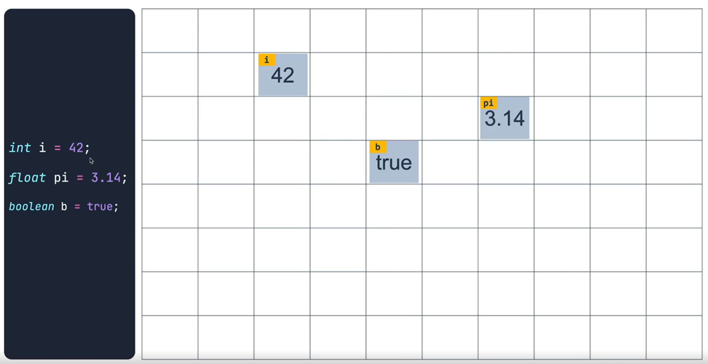
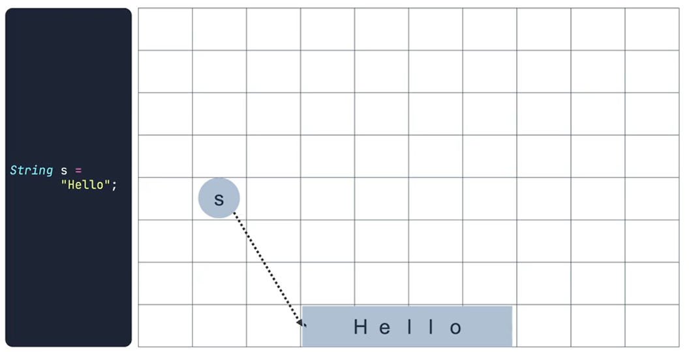
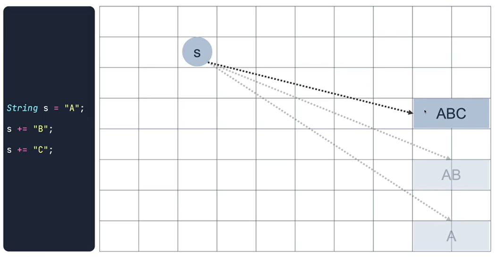
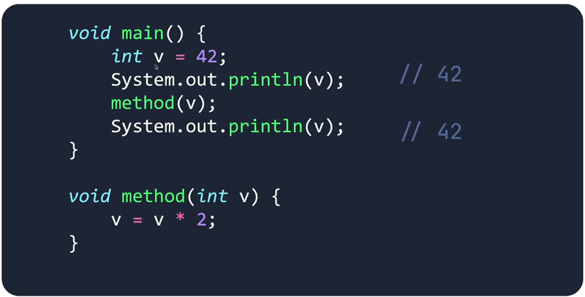
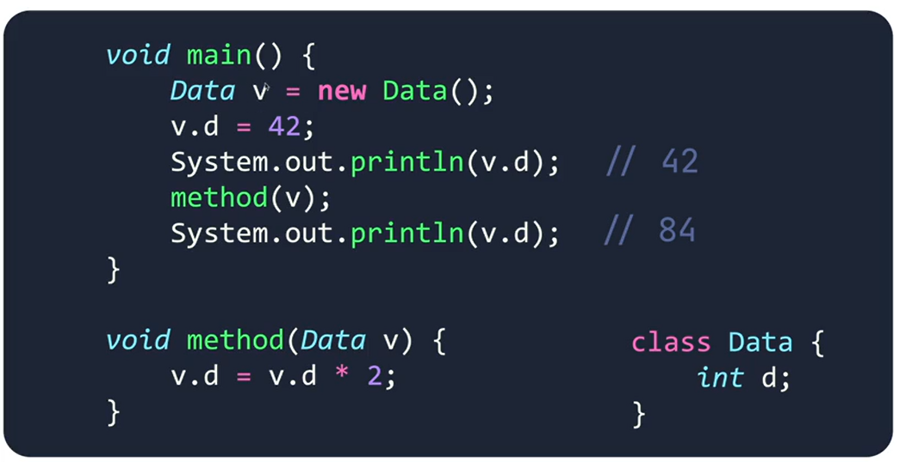

### JAVA는 데이터를 어떻게 표현하는가?

#### Primitive
<table>
    <tr>
        <th>타입</th>
        <th>크기</th>
        <th>범위</th>
    <tr>
    <tr>
        <td>byte</td>
        <td>1 byte</td>
        <td>-27 ~ 27 - 1</td>
    </tr>
    <tr>
        <td>short</td>
        <td>2 bytes</td>
        <td>- 215 ~ 215 - 1</td>
    </tr>
    <tr>
        <td>int</td>
        <td>4 bytes</td>
        <td>- 231 ~ 231 - 1</td>
    </tr>
    <tr>
        <td>long</td>
        <td>8 bytes</td>
        <td>- 263 ~ 263 - 1</td>
    </tr>
    <tr>
        <td>float</td>
        <td>4 bytes</td>
        <td>- 1.111 x 2127 ~ 1.111 x 2127</td>
    </tr>
    <tr>
        <td>double</td>
        <td>8 bytes</td>
        <td>- 1.111 x 21023 ~ 1.111 x 21023</td>
    </tr>
    <tr>
        <td>char</td>
        <td>2 byte</td>
        <td>0 ~ 216-1</td>
    </tr>
    <tr>
        <td>boolean</td>
        <td>not defined</td>
        <td></td>
    </tr>
</table>

 

#### Reference
Primitive가 아닌 모든 데이터 타입.. Object type이라고도 함.

Primitive 타입을 Reference 타입으로 변경 할 수있도록 제공함
- Byte
- Short
- Integer
- Long
- Float
- Double
- Character
- Boolean

### Primitive vs Reference 

Primitive type은 메모리에 직접적으로 값이 저장이 됨

 

Reference type은 데이터를 직접 저장하지 않고, 데이터(인스턴스)가 저장이 된 주소값을 저장함.

또한 String type 특징으로 저장된 값이 변할 때 기존 데이터가 변경이 되는것이 아닌, 새로운 주소에 변경된 데이터가 저장이 됨.

이와같은 String의 특징을 **Immutable(불변성)**이라고 함.

 

이러한 Primitive type과 Reference type의 특징을 통해 Call by Value와 Call by Reference를 알 수있다.

#### Call by Value

#### Call by Reference

변경되는 값은 새로운 데이터로 저장이 되기때문에 다른 주소로 저장되어 값이 다르게 나옴.

 

> 💡 내가 만든 메서드가 Call by Value인지 Call by Reference인지 알아야함.