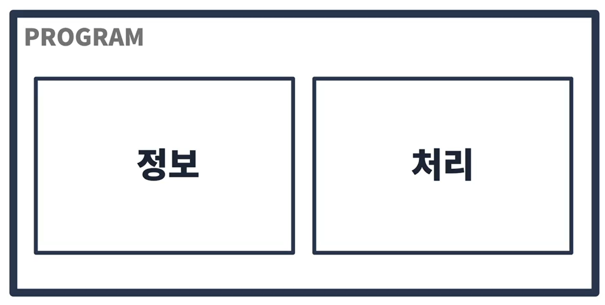
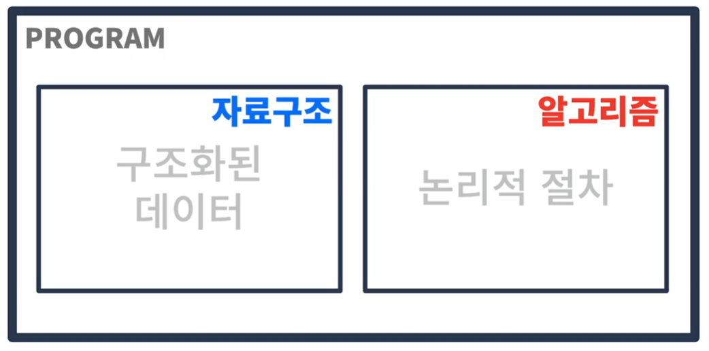
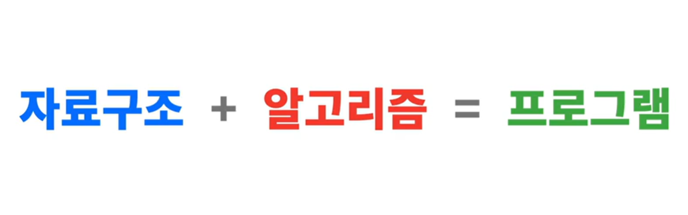
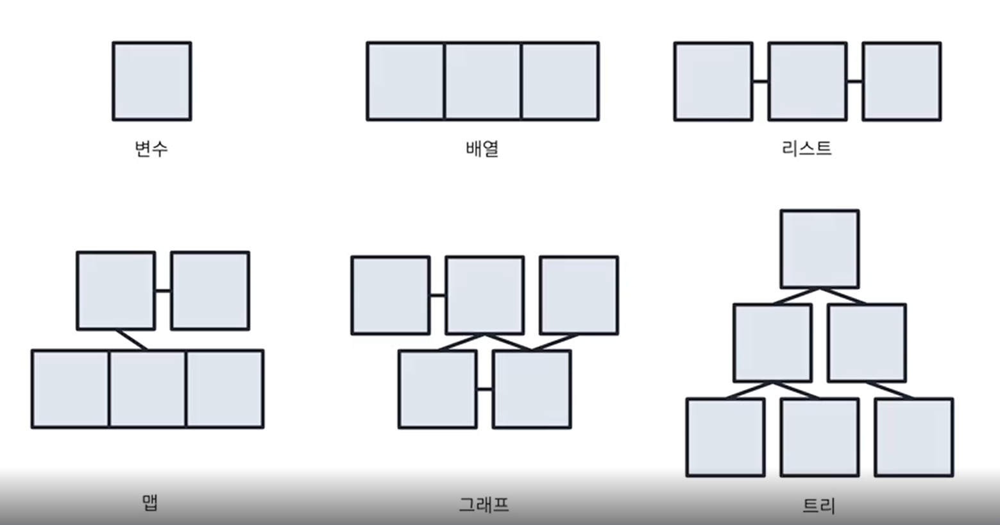

## 오리엔테이션

 

### 강의 소개

우리는 컴퓨터를 정보처리 기기라고 부른다.

 

정보는 구조화된 데이터, 처리는 논리적인 절차가 된다.

 

우리는 구조화된 데이터화 알고리즘을 통해 프로그램을 만들것이다.

 

 

### Overview

가장 단순한 형태로 독립적인 존재하는 **변수**와, 
여러개를 묶어서 표현하기 위해 **배열**과 **리스트**의 특징과 장단점에 대해서 학습을 할 것이다.

또한 **배열**과 **리스트**와같은 선형 자료구조 외에도,
한 줄로 표현하지 못하는 비선형 자료구조인 **맵**, **그래프**, **트리**를 활용 할 수 있는지 학습 할 것이다.