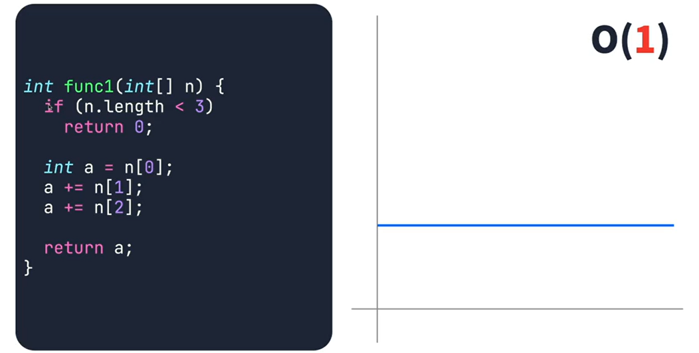
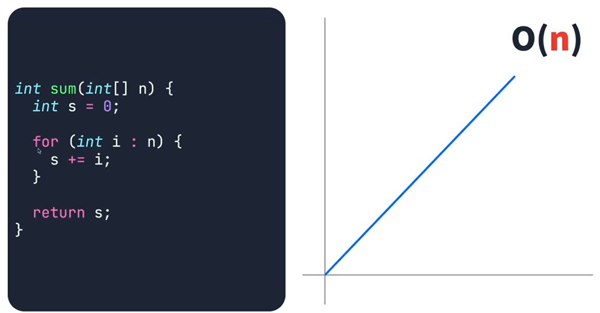
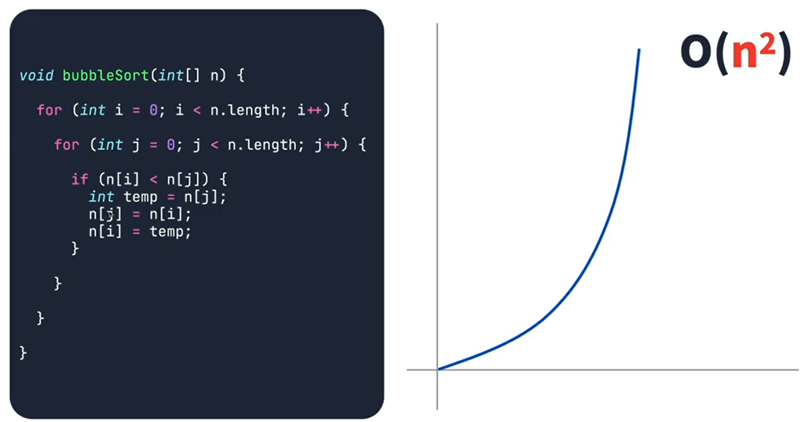
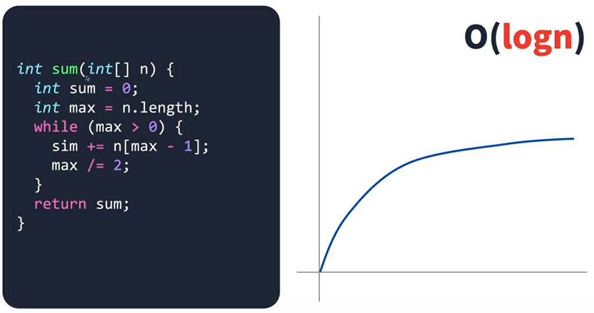
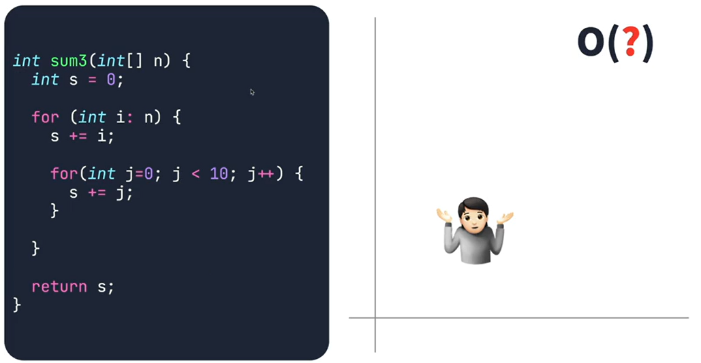
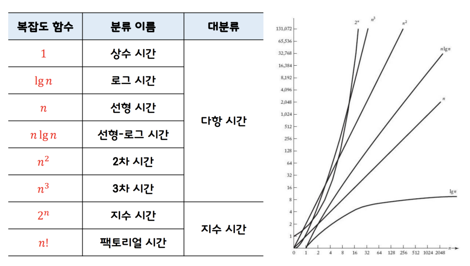

### 좋은 프로그램이란?

- 신뢰성이 높은 알고리즘
- **처리 효율이 높은 알고리즘**
- 일반적으로 적용이 가능한 알고리즘
- 확장성이 있는 알고리즘
- 이해하기 쉬운 알고리즘
- 이식서잉 높은 알고리즘

이 프로그램이 동작 할때 어떻게 동작하는것이 효율이 높은지가 중요함.

이때 효율을 시간 복잡도라고 부르고, Big O 표기법으로 나타냄

---

#### 시간 복잡도

n이 무한으로 증가해도 항상 일정함

n에 비례해서 증가함

n이 증가 할 수록 연산은 제곱만큼 증가함

n이 연산을 통해 줄어나갈때

활용) 밖에서 n번 돌고 안에서 10번 돌기에 10n으로 생각 할 수 있지만, 무한으로 간다면 상수값은 무의미하기 때문에 O(n)으로 표현함

#### 시간 복잡도의 순서

