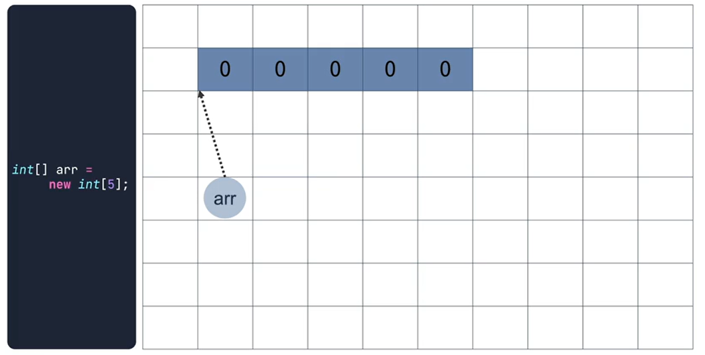
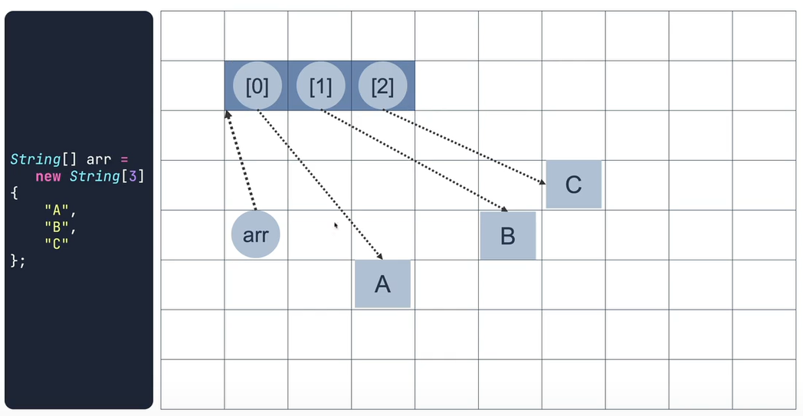
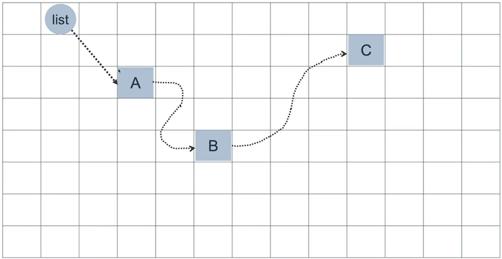
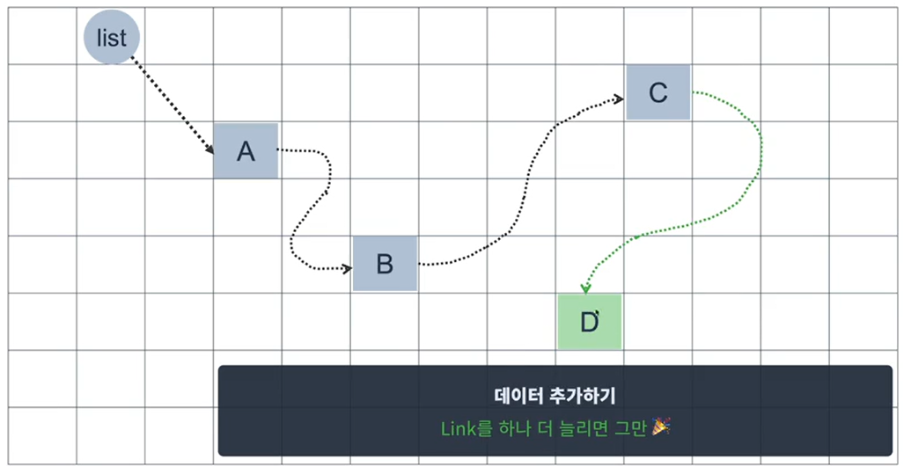
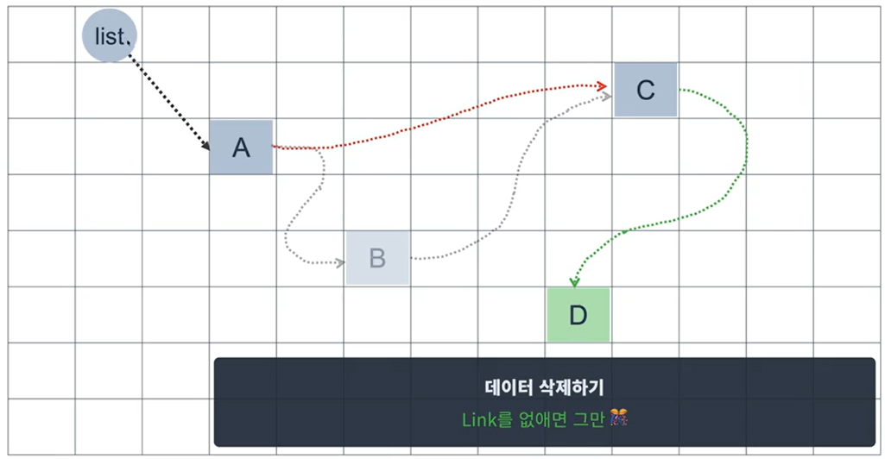
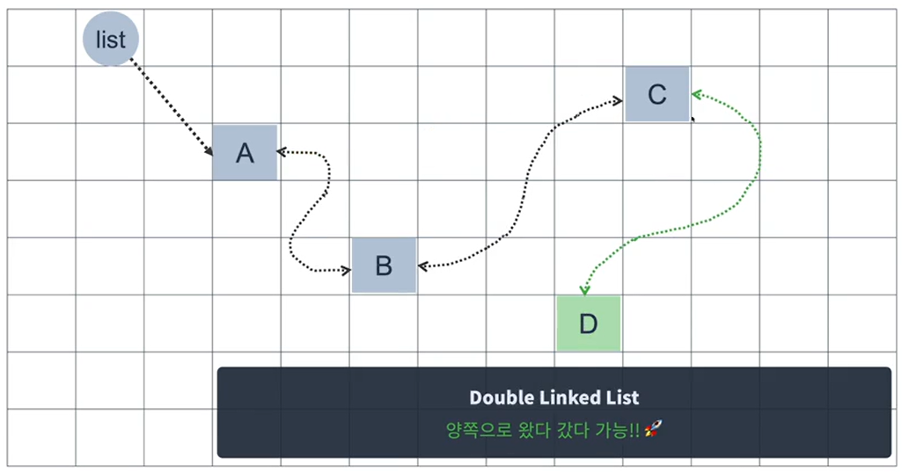

### Array

```java
public class Main {
    public static void main(String[] args){
        int[] arr = new int[5];
        System.out.println(Arrays.toString(arr));
        // arr의 초기값 : [0, 0, 0, 0, 0]
        // String -> null
        // boolean -> false
    }
}
```

Array는 메모리상에 연속적으로 데이터들을 저장시킬수 있다.


실제 배열 요소에는 레퍼런스들만 저장이 되어 오브젝트를 참조하고, 오브젝트는 메모리 어딘가에 따로 저장된다. 


<br>

#### Array의 특징
1. [ 장점 ] 여러개의 데이터를 한꺼번에 다룰 수 있다.
2. [ 특징 ] Array는 Object는 아니지만 Reference Value로 취급된다.
3. [ 특징 ] 메모리상에 연달아 공간을 확보한다.
4. [ 단점 ] 미리 공간을 확보해 놓고 써야 한다.
5. [ 단점 ] 한 번 만들어진 공간은 크기가 고정된다.
6. [ 장점 ] 첫 번째 위치만 알면 index로 상대적 위치를 빠르게 찾을 수 있다.

<br>
<hr>
<br>

> 
> Array는 유연하지 못하네?
> 유연하게 쓸 수 없을까?
> 미리 몇 개가 필요 한지 몰라도 쓸 수 있으면 좋을텐데
> 필요에 따라 크기가 늘거나 줄어들면 좋을꺼같은데!
> => List 활용
> 

### List

다음 요소를 인접할 필요없이 링크만 연결되어 있으면 다음 요소에 접근 할 수 있음.


해당 List는 Link로 연결되었다 하여 **Linked List**라고 하고, 데이터의 추가 삭제가 자유롭다.



Linked List는 단방향으로 중간지점에서 다른 위치를 찾으려면 다시 처음부터 탐색을 하여야 한다.
이를 보완하기 위해 양방향 탐색인 **Double Linked List**가 있다.


<br>

#### List의 특징
1. [ 장점 ] 여러개의 데이터를 한꺼번에 다룰 수 있다.
2. [ 장점 ] 메모리상에 연속되지 않아도 된다.
3. [ 장점 ] 미리 공간을 확보해 놓지 않아도 된다.
4. [ 장점 ] 필요에 따라 데이터가 늘어나거나 줄어든다.
5. [ 단점 ] 첫 번째 위치로 부터 index로 목표위치를 알려면 한 칸 한 칸 이동하면서 찾아야 한다.

<br>
<hr>
<br>

#### Array vs List

> Array는 메모리상에 연속되어 저장되기 때문에 탐색에 유리하다.
> List는 자유롭게 저장이 되기때문에 삽입 삭제에 유리하다.
> 