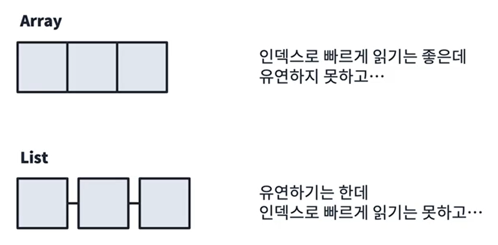
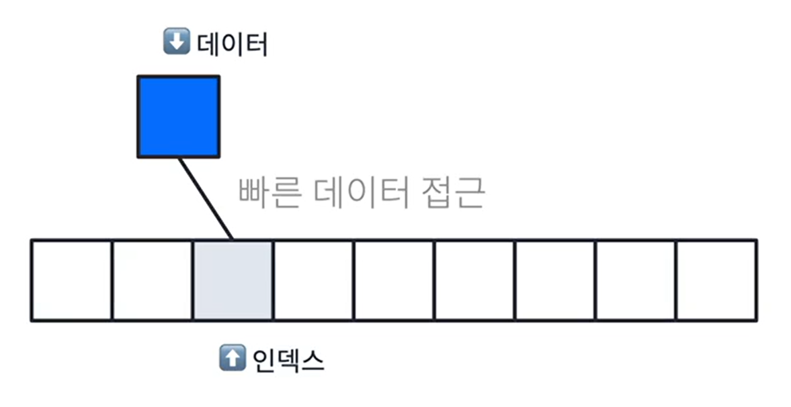
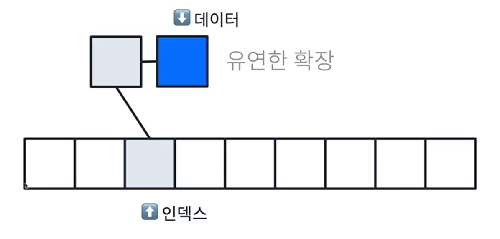
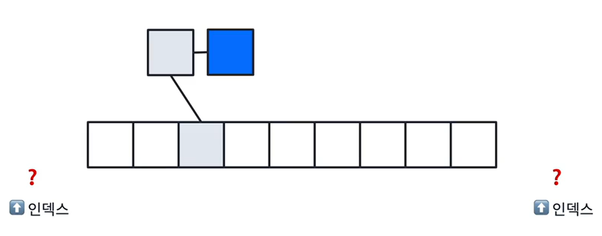
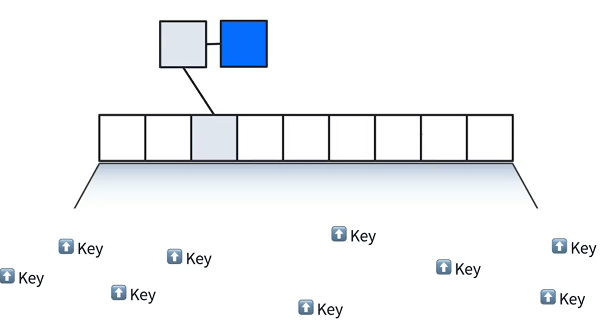
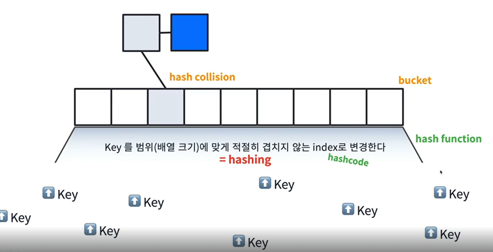
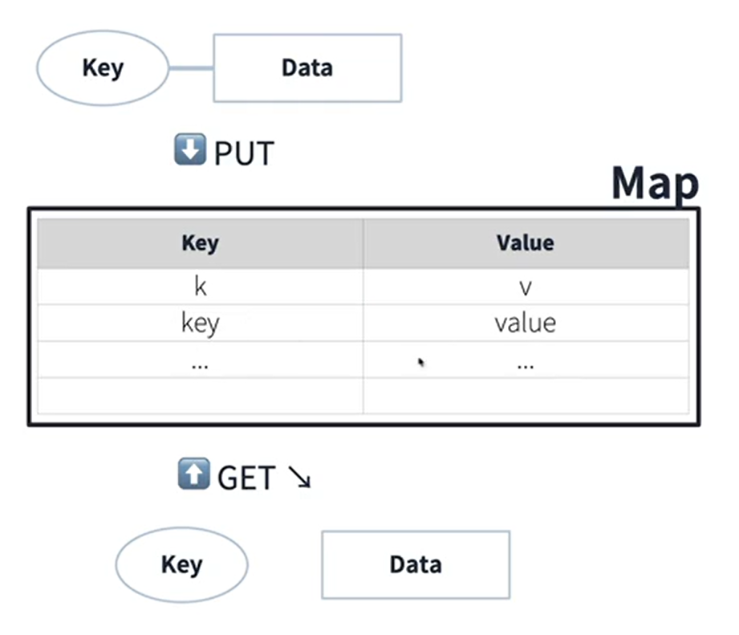

### MAP

#### Array와 List의 특징

>
> 💡 유연하면서도 빠르게 읽어내는 방법은 없을까?
>

 

#### 장점들을 합친다면?

 

#### 문제점

한 인덱스에 많은 데이터가 몰리게 되면, 탐색하는데 오랜시간이 걸리므로 인덱스 설정이 어려움

 

데이터가 적절히 분산이 되면서, 인덱스가 불필요한 자료구조가 필요하다.  
그러기 위해 Key를 활용한 Map을 알아보자.

 

#### Map의 요소

- **Hashing** : key를 겹치지 않게 mapping 하는 것.
- **Hash Function** : Hashing하는 기능을 수행하는 것, key 값을 hash code으로 변경 ( hashcode == index )
- **bucket** : Map의 array를 bucket이라 칭함.
- **hash collision** : hash가 충돌했다!, key는 다르지만 같은 hash값을 가지는 것.  
hash가 충돌하더라도 데이터를 보존 할 수 있도록 list 형태를 가짐, 이를 체이닝이라고 한다.

 

그렇기에 기본적으로 아래와 같은 형태를 띈다.
map은 dictionary라고도 부르며, 매칭이 되어있는 상태이기에 O(1)의 시간복잡도를 가진다.

