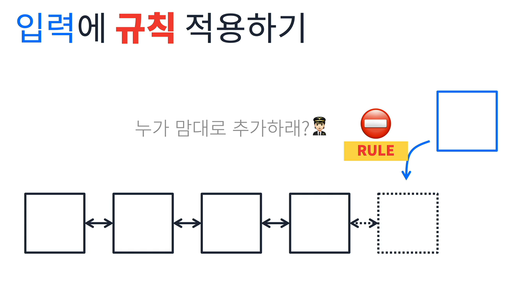

### Set(집합)

Array나 List, Map은 데이터를 넣고, 빼고 중복되면 덮어쓰거나 추가하는 특징이 있었음.  
  
그러나 중복이 없어야 하는 경우에는?  

값을 추가할때 중복된 값을 허용하지 말자!

 

#### 이미 존재하는걸 어떻게 아는가?

Search 해야지!  

>
> 💡 Set : 선형 데이터 구조 + 탐색 알고리즘
> 

 

## 집합의 종류
