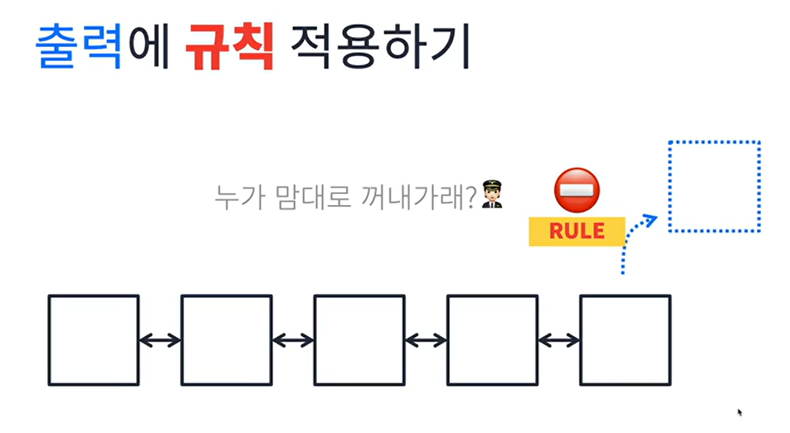
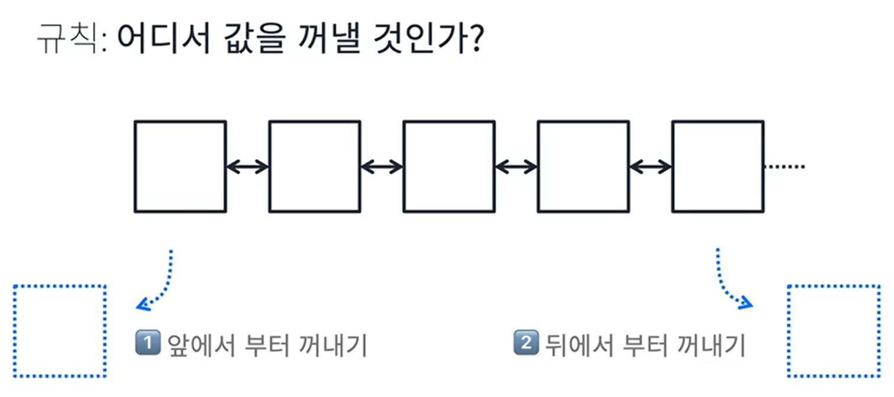
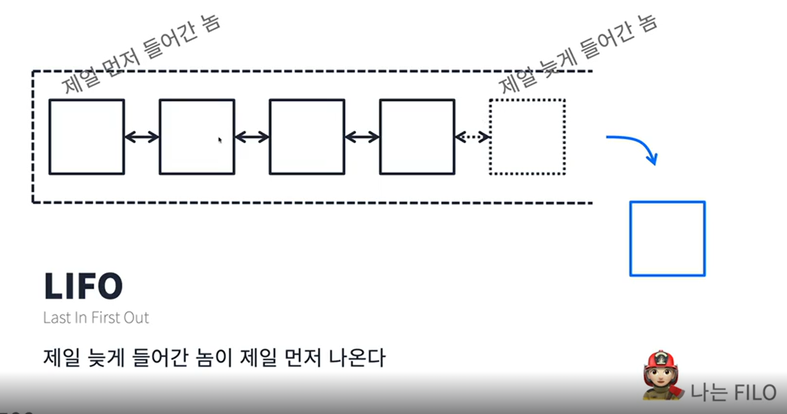
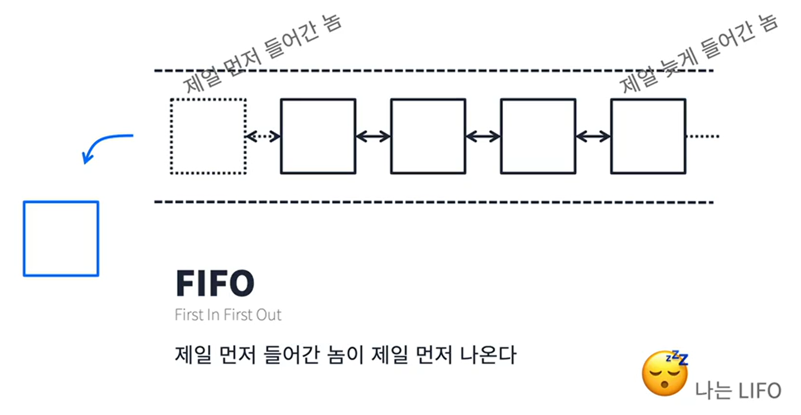

# Set은 넣을때 규칙이 있음, 그럼 꺼낼때는?

 

## 앞에서 부터 꺼내기 

### Stack

**LIFO** : Last In, Fast Out  
**FILO** : First In, Last Out

 

## 뒤에서 부터 꺼내기

### Queue

**FIFO** : First In, Fast Out  
**LIFO** : Last In, First Out

