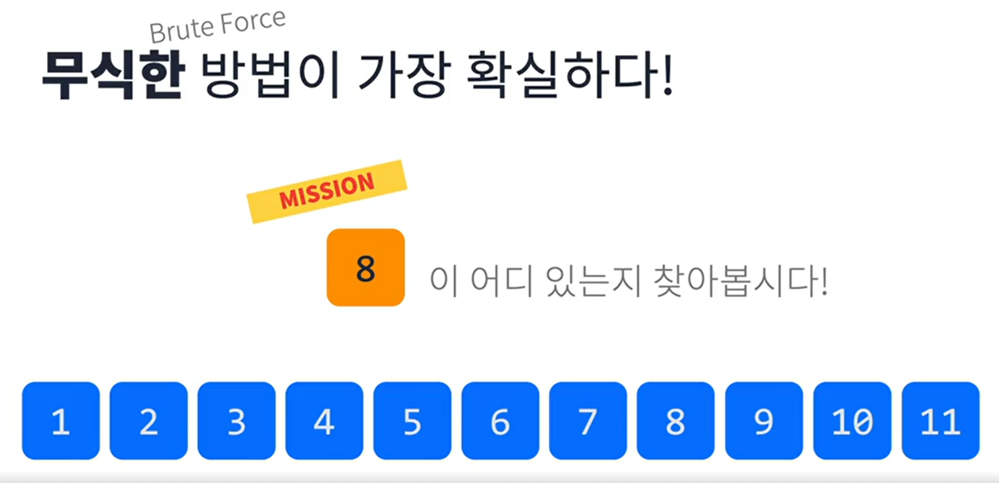
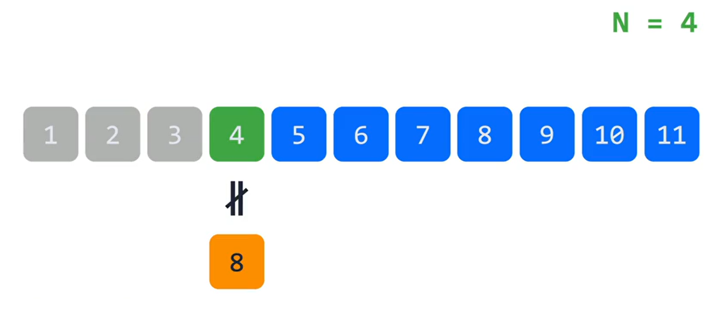
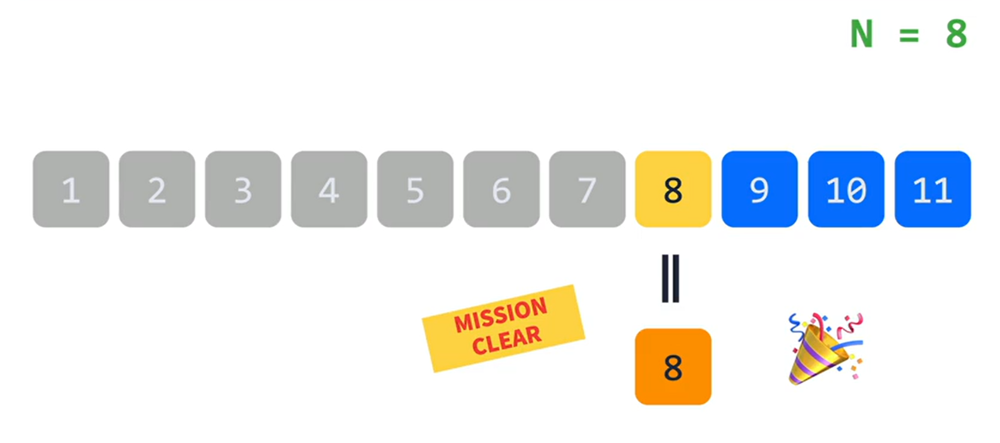
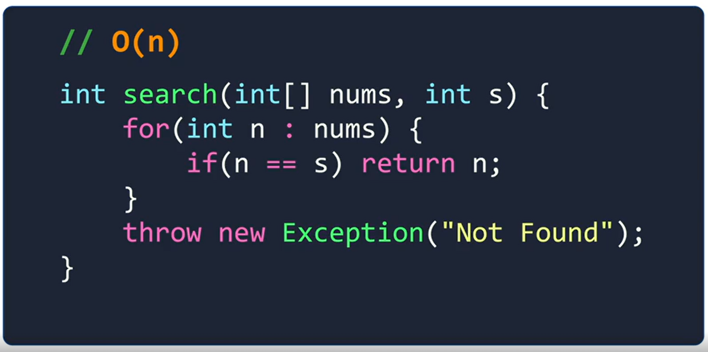
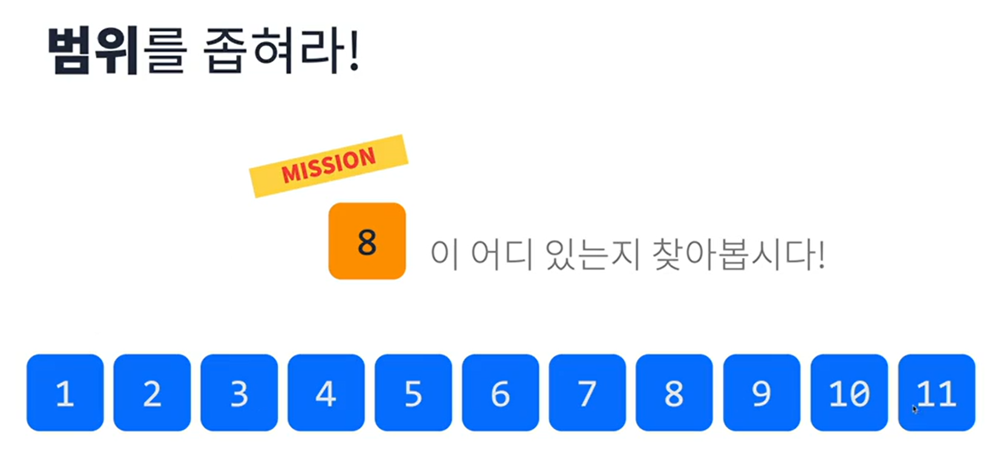
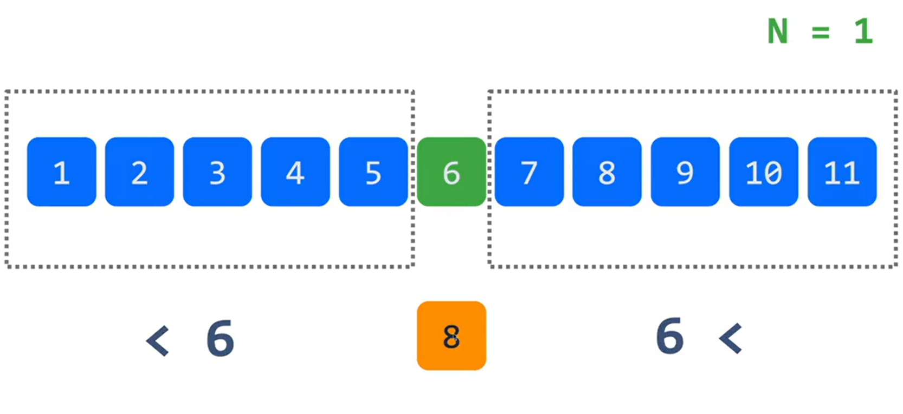
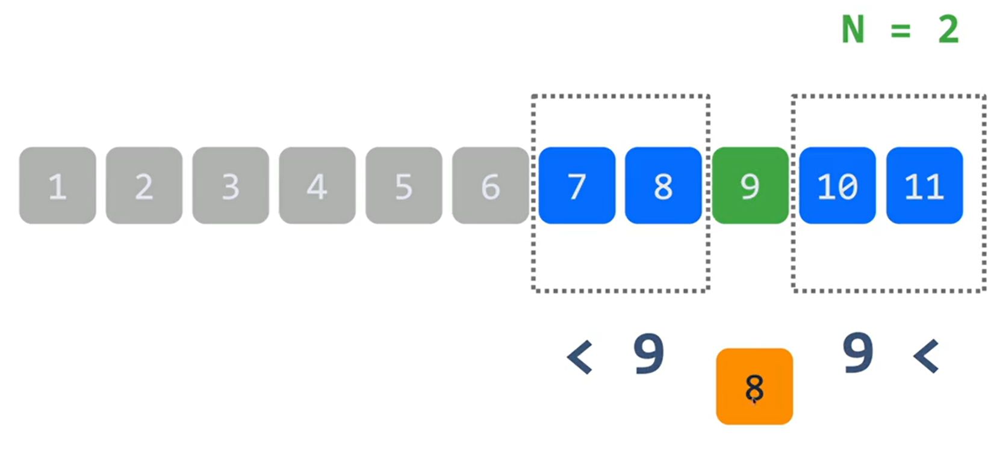
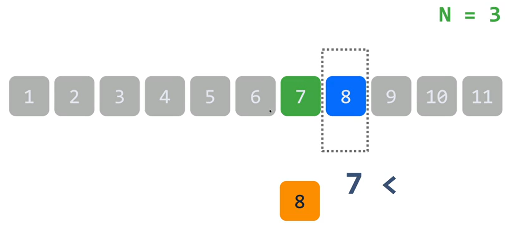
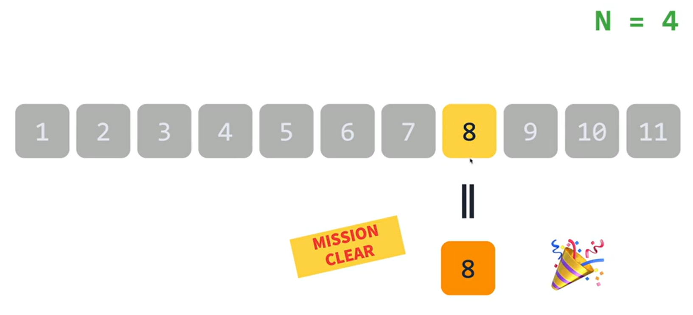
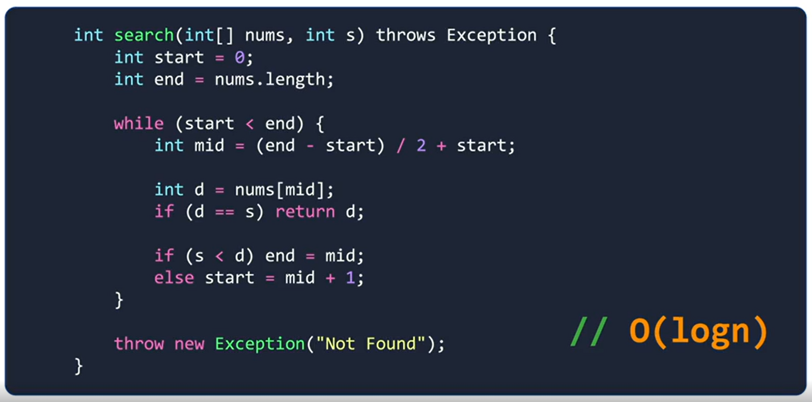

# Linear Search

### Array와 List의 공통점은?
여러 개의 데이터가 선형으로 저장되어 한꺼번에 다룰 수 있다!

 

>
> 💡 그럼 선형으로 구성된 데이터에서는 원하는 데이터를 어떻게 찾는가?
> 

### 1. Brute Force

 

#### 자바로 구현한다면?

 

>
> 💡 어떻게 더 빠르게 찾을 수 있는가?
> 

### 2. Binary Search

 

#### 자바로 구현한다면?

 

